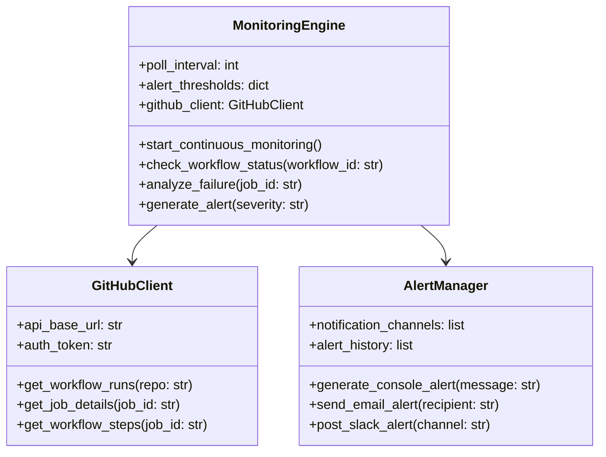
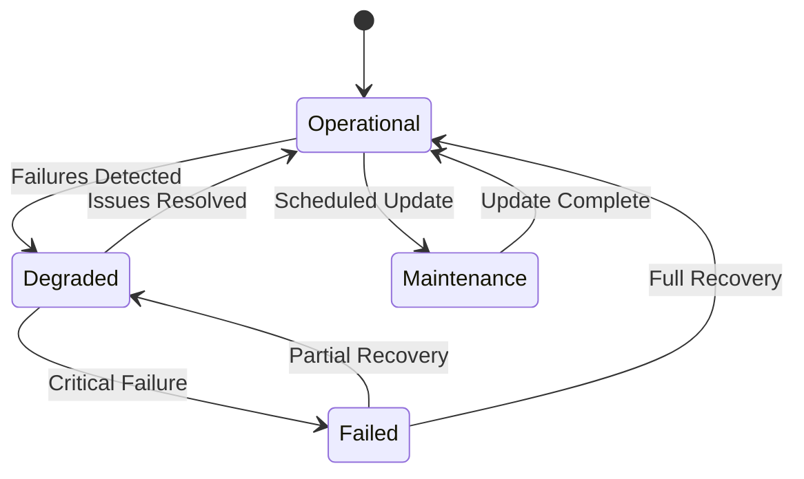

# CI/CD Monitoring System Technical Specification

## 1. System Overview

### 1.1 Purpose

This document provides the technical specification for the CI/CD Monitoring and Automated Error Fixing System for the MT-logo-render project. The system is designed to provide comprehensive monitoring, intelligent error resolution, and test coverage enhancement capabilities.

### 1.2 Scope

The system consists of three main components:
1. **Monitoring Engine**: Real-time surveillance of GitHub Actions workflows
2. **Auto-Fix Engine**: Intelligent error detection and resolution
3. **Coverage Analyzer**: Test coverage analysis and enhancement

### 1.3 Definitions

| Term | Definition |
|------|-----------|
| CI/CD | Continuous Integration/Continuous Delivery |
| GH API | GitHub REST API |
| jq | JSON processing tool |
| KPI | Key Performance Indicator |
| MTTR | Mean Time To Resolution |

## 2. Monitoring Engine Specification

### 2.1 Architecture



### 2.2 API Endpoints

| Endpoint | Method | Description |
|----------|--------|-------------|
| `/repos/{owner}/{repo}/actions/runs` | GET | List workflow runs |
| `/repos/{owner}/{repo}/actions/runs/{run_id}` | GET | Get workflow run details |
| `/repos/{owner}/{repo}/actions/runs/{run_id}/jobs` | GET | List jobs for a workflow run |
| `/repos/{owner}/{repo}/actions/jobs/{job_id}` | GET | Get job details |
| `/repos/{owner}/{repo}/actions/jobs/{job_id}/logs` | GET | Get job logs |

### 2.3 Polling Algorithm

```python
def continuous_monitoring_loop():
    """
    Main monitoring loop with adaptive polling
    """
    while True:
        try:
            # Get latest workflow runs
            runs = github_client.get_workflow_runs(REPO)

            # Process each run
            for run in runs:
                if run['status'] == 'in_progress':
                    monitor_in_progress_run(run)
                elif run['conclusion'] == 'failure':
                    analyze_failed_run(run)
                elif run['conclusion'] == 'success':
                    update_success_metrics(run)

            # Adaptive polling based on activity
            if recent_failures > 0:
                poll_interval = max(30, 60 - (recent_failures * 5))
            else:
                poll_interval = 60

            time.sleep(poll_interval)

        except Exception as e:
            log_error(f"Monitoring error: {str(e)}")
            time.sleep(300)  # 5 minute delay on errors
```

### 2.4 Failure Detection Patterns

| Pattern ID | Description | Detection Method | Severity |
|------------|-------------|------------------|----------|
| PAT-001 | Compilation Failure | `conclusion == "failure"` in build job | Critical |
| PAT-002 | Test Failure | `conclusion == "failure"` in test job | High |
| PAT-003 | Security Vulnerability | Security scan artifacts contain issues | Critical |
| PAT-004 | License Compliance | License check fails | Medium |
| PAT-005 | Timeout | Job runs longer than expected | Medium |
| PAT-006 | Dependency Issue | "command not found" in logs | High |

## 3. Auto-Fix Engine Specification

### 3.1 Pattern Database Structure

```json
{
  "patterns": {
    "PAT-001": {
      "name": "Clippy Warnings",
      "description": "Automatically fixable clippy warnings",
      "detection": {
        "log_pattern": "warning:.*",
        "exit_code": 1
      },
      "fix": {
        "command": "cargo clippy --fix",
        "safety_level": "high",
        "rollback": false
      },
      "validation": {
        "pre": "cargo check",
        "post": "cargo clippy --quiet"
      }
    },
    "PAT-002": {
      "name": "Dependency Issues",
      "description": "Missing or outdated dependencies",
      "detection": {
        "log_pattern": "command not found|import error",
        "exit_code": 127
      },
      "fix": {
        "command": "cargo update || pip install {missing_package}",
        "safety_level": "medium",
        "rollback": true
      },
      "validation": {
        "pre": "cargo build --dry-run",
        "post": "cargo test --no-run"
      }
    }
  }
}
```

### 3.2 Fix Execution Algorithm

```python
def execute_fix(pattern_id, context):
    """
    Execute automated fix with comprehensive safety checks

    Args:
        pattern_id: Pattern identifier
        context: Execution context including job details

    Returns:
        dict: Fix execution result
    """
    # Load pattern from database
    pattern = PATTERN_DATABASE.get(pattern_id)
    if not pattern:
        return {"success": False, "error": "Pattern not found"}

    # Pre-fix validation
    if not run_validation(pattern, context, "pre"):
        return {"success": False, "error": "Pre-validation failed"}

    # Create backup
    backup_result = create_backup(context)
    if not backup_result["success"]:
        return backup_result

    # Execute fix
    try:
        fix_command = pattern["fix"]["command"].format(**context)
        result = subprocess.run(
            fix_command,
            shell=True,
            capture_output=True,
            text=True,
            timeout=300
        )

        if result.returncode != 0:
            raise Exception(f"Fix command failed: {result.stderr}")

        # Post-fix validation
        if not run_validation(pattern, context, "post"):
            raise Exception("Post-validation failed")

        return {
            "success": True,
            "pattern_id": pattern_id,
            "fix_applied": fix_command,
            "validation": "passed"
        }

    except Exception as e:
        # Rollback if required
        if pattern["fix"].get("rollback", False):
            rollback(backup_result["backup_id"])

        return {
            "success": False,
            "pattern_id": pattern_id,
            "error": str(e),
            "rollback": pattern["fix"].get("rollback", False)
        }
```

### 3.3 Safety Levels

| Safety Level | Description | Requirements |
|--------------|-------------|--------------|
| High | Safe to apply automatically | - No code logic changes<br>- Reversible operations<br>- Comprehensive validation |
| Medium | Requires validation | - Potential side effects<br>- Manual review recommended<br>- Backup required |
| Low | Manual approval required | - Significant code changes<br>- Potential breaking changes<br>- Extensive testing needed |

## 4. Test Coverage Analyzer Specification

### 4.1 Coverage Metrics

```python
class CoverageMetrics:
    def __init__(self):
        self.line_coverage = 0.0
        self.branch_coverage = 0.0
        self.function_coverage = 0.0
        self.integration_coverage = 0.0
        self.total_coverage = 0.0

    def calculate_total(self):
        """Calculate overall coverage score"""
        weights = {
            "line": 0.4,
            "branch": 0.3,
            "function": 0.2,
            "integration": 0.1
        }
        self.total_coverage = (
            self.line_coverage * weights["line"] +
            self.branch_coverage * weights["branch"] +
            self.function_coverage * weights["function"] +
            self.integration_coverage * weights["integration"]
        )
        return self.total_coverage
```

### 4.2 Coverage Analysis Algorithm

```python
def analyze_coverage(cobertura_xml):
    """
    Analyze coverage data and identify gaps

    Args:
        cobertura_xml: Path to Cobertura XML report

    Returns:
        dict: Coverage analysis results
    """
    # Parse coverage report
    tree = ET.parse(cobertura_xml)
    root = tree.getroot()

    # Extract coverage metrics
    metrics = CoverageMetrics()
    metrics.line_coverage = float(root.attrib['line-rate']) * 100
    metrics.branch_coverage = float(root.attrib['branch-rate']) * 100

    # Identify uncovered files
    uncovered_files = []
    for package in root.findall('packages/package'):
        for file in package.findall('classes/class'):
            if float(file.attrib['line-rate']) < 1.0:
                uncovered_files.append({
                    "name": file.attrib['filename'],
                    "line_coverage": float(file.attrib['line-rate']) * 100,
                    "branch_coverage": float(file.attrib['branch-rate']) * 100,
                    "complexity": float(file.attrib['complexity'])
                })

    # Sort by coverage gap
    uncovered_files.sort(key=lambda x: x['line_coverage'])

    return {
        "metrics": {
            "line": metrics.line_coverage,
            "branch": metrics.branch_coverage,
            "total": metrics.calculate_total()
        },
        "uncovered_files": uncovered_files,
        "coverage_gaps": identify_gaps(uncovered_files)
    }
```

### 4.3 Test Generation Strategies

| Strategy | Description | Implementation |
|----------|-------------|----------------|
| Property-Based | Generate tests based on properties | Hypothesis library |
| Fuzz Testing | Random input generation | AFL, libFuzzer |
| Mutation Testing | Modify code to test effectiveness | Mutagen |
| Coverage-Guided | Target uncovered code paths | Custom analyzer |

## 5. Integration Specification

### 5.1 GitHub Actions Integration

```yaml
name: CI Monitoring and Auto-Fix

on:
  workflow_run:
    workflows: ["CI/CD Pipeline"]
    types: [completed]
  schedule:
    - cron: '0 * * * *'  # Hourly monitoring

jobs:
  monitor:
    name: CI Monitoring
    runs-on: ubuntu-latest
    steps:
      - name: Checkout code
        uses: actions/checkout@v4

      - name: Set up Python
        uses: actions/setup-python@v4
        with:
          python-version: '3.x'

      - name: Install dependencies
        run: |
          python -m pip install --upgrade pip
          pip install requests pygithub jq

      - name: Run CI Monitor
        run: python scripts/ci_monitor.py --mode github-actions
        env:
          GITHUB_TOKEN: ${{ secrets.GITHUB_TOKEN }}

      - name: Upload monitoring report
        uses: actions/upload-artifact@v4
        with:
          name: ci-monitoring-report
          path: monitoring-report.json

  auto-fix:
    name: Auto-Fix
    needs: monitor
    if: needs.monitor.outputs.fix_required == 'true'
    runs-on: ubuntu-latest
    steps:
      - name: Checkout code
        uses: actions/checkout@v4

      - name: Set up Python
        uses: actions/setup-python@v4
        with:
          python-version: '3.x'

      - name: Download monitoring report
        uses: actions/download-artifact@v4
        with:
          name: ci-monitoring-report

      - name: Apply Auto-Fixes
        run: python scripts/auto_fix.py --report monitoring-report.json --mode safe
        env:
          GITHUB_TOKEN: ${{ secrets.GITHUB_TOKEN }}

      - name: Commit and push fixes
        if: steps.auto-fix.outputs.changes_made == 'true'
        run: |
          git config --global user.name "CI Auto-Fix Bot"
          git config --global user.email "ci-bot@example.com"
          git add .
          git commit -m "chore: Auto-fix CI failures [skip ci]"
          git push origin HEAD
```

### 5.2 Pre-Commit Integration

```yaml
repos:
  - repo: local
    hooks:
      - id: ci-monitoring-pre-commit
        name: CI Monitoring Pre-Commit Check
        entry: python scripts/ci_monitor.py --mode pre-commit
        language: system
        pass_filenames: false
        stages: [pre-commit]

      - id: auto-fix-pre-commit
        name: Auto-Fix Pre-Commit
        entry: python scripts/auto_fix.py --mode pre-commit --safety high
        language: system
        pass_filenames: false
        stages: [pre-commit]
```

## 6. State Management Specification

### 6.1 State Capsule Structure

```json
{
  "$schema": "https://json-schema.org/draft/2020-12/schema",
  "title": "CI Monitoring State Capsule",
  "type": "object",
  "properties": {
    "monitoring_state": {
      "type": "object",
      "properties": {
        "last_run_id": {
          "type": "integer",
          "description": "Last processed workflow run ID"
        },
        "current_status": {
          "type": "string",
          "enum": ["operational", "degraded", "failed"],
          "description": "Current system status"
        },
        "coverage_metrics": {
          "type": "object",
          "properties": {
            "line": {"type": "number", "minimum": 0, "maximum": 100},
            "branch": {"type": "number", "minimum": 0, "maximum": 100},
            "function": {"type": "number", "minimum": 0, "maximum": 100},
            "integration": {"type": "number", "minimum": 0, "maximum": 100}
          }
        },
        "recent_failures": {
          "type": "array",
          "items": {
            "type": "object",
            "properties": {
              "run_id": {"type": "integer"},
              "failure_type": {"type": "string"},
              "severity": {"type": "string"},
              "timestamp": {"type": "string", "format": "date-time"},
              "resolved": {"type": "boolean"}
            }
          }
        },
        "auto_fix_history": {
          "type": "array",
          "items": {
            "type": "object",
            "properties": {
              "timestamp": {"type": "string", "format": "date-time"},
              "pattern_id": {"type": "string"},
              "success": {"type": "boolean"},
              "rollback": {"type": "boolean"},
              "details": {"type": "string"}
            }
          }
        }
      },
      "required": ["last_run_id", "current_status", "coverage_metrics"]
    }
  }
}
```

### 6.2 State Transition Diagram



## 7. Performance Requirements

### 7.1 Monitoring Performance

| Metric | Target | Measurement Method |
|--------|--------|---------------------|
| Polling Frequency | 60 seconds (normal)<br>30 seconds (degraded) | Time between API calls |
| Detection Latency | < 2 minutes | Time from failure to detection |
| Analysis Time | < 30 seconds | Time to analyze failure patterns |
| Alert Delivery | < 1 minute | Time from detection to alert |

### 7.2 Auto-Fix Performance

| Metric | Target | Measurement Method |
|--------|--------|---------------------|
| Fix Execution Time | < 5 minutes | Time from detection to resolution |
| Success Rate | > 85% | Percentage of successful fixes |
| Rollback Time | < 2 minutes | Time to revert failed fixes |
| Validation Time | < 1 minute | Time for pre/post validation |

### 7.3 Coverage Analysis Performance

| Metric | Target | Measurement Method |
|--------|--------|---------------------|
| Analysis Time | < 2 minutes | Time to process coverage reports |
| Gap Identification | < 30 seconds | Time to identify coverage gaps |
| Test Generation | < 5 minutes | Time to generate new tests |
| Coverage Improvement | > 1% per iteration | Coverage increase per run |

## 8. Security Requirements

### 8.1 Authentication

- GitHub API token with appropriate scopes
- Token rotation every 90 days
- Secure storage in GitHub Secrets
- Minimal required permissions

### 8.2 Data Protection

- No storage of sensitive information
- Encrypted communication (HTTPS)
- Secure logging (no credentials)
- Access control for monitoring data

### 8.3 Audit Requirements

- Comprehensive logging of all actions
- Immutable audit trail
- Regular security reviews
- Compliance with GitHub security policies

## 9. Error Handling

### 9.1 Monitoring Errors

| Error Type | Recovery Strategy |
|------------|-------------------|
| API Rate Limit | Exponential backoff |
| Network Failure | Retry with delay |
| Authentication Failure | Alert and stop |
| Data Parsing Error | Skip and log |
| Unexpected Response | Alert and continue |

### 9.2 Auto-Fix Errors

| Error Type | Recovery Strategy |
|------------|-------------------|
| Fix Failure | Automatic rollback |
| Validation Failure | Alert and rollback |
| Timeout | Kill process and rollback |
| Permission Error | Alert and stop |
| Unexpected Error | Alert and rollback |

## 10. Deployment Requirements

### 10.1 Environment Requirements

| Component | Version | Notes |
|-----------|---------|-------|
| Python | 3.8+ | Required for scripts |
| GitHub CLI | 2.0+ | For manual operations |
| jq | 1.6+ | JSON processing |
| cargo | Latest | Rust toolchain |
| pip | Latest | Python packages |

### 10.2 Dependency Requirements

```toml
[tool.poetry.dependencies]
python = "^3.8"
requests = "^2.28.0"
pygithub = "^1.55"
jq = "^1.2.0"
click = "^8.1.0"
pyyaml = "^6.0"
xmltodict = "^0.13.0"
```

## 11. Testing Requirements

### 11.1 Unit Testing

| Component | Test Coverage Target | Test Cases |
|-----------|----------------------|------------|
| Monitoring Engine | 100% | API parsing, failure detection |
| Auto-Fix Engine | 100% | Pattern matching, fix execution |
| Coverage Analyzer | 100% | Metrics calculation, gap identification |

### 11.2 Integration Testing

| Integration Point | Test Coverage Target | Test Cases |
|-------------------|----------------------|------------|
| GitHub API | 100% | Authentication, rate limiting |
| Monitoring + Auto-Fix | 100% | End-to-end failure resolution |
| CI/CD Pipeline | 100% | Workflow integration |

### 11.3 Performance Testing

| Scenario | Target | Measurement |
|----------|--------|-------------|
| High Load | 100 concurrent jobs | Response time |
| Failure Storm | 50 simultaneous failures | Processing time |
| Coverage Analysis | 10,000+ lines | Analysis time |

## 12. Maintenance Requirements

### 12.1 Monitoring

- Daily health checks
- Weekly performance reviews
- Monthly pattern database updates
- Quarterly security audits

### 12.2 Updates

- Bi-weekly pattern database updates
- Monthly dependency updates
- Quarterly major version updates
- Annual architecture reviews

### 12.3 Documentation

- Continuous update with changes
- Versioned documentation
- Change log maintenance
- User guide updates

## 13. Compliance Requirements

### 13.1 GitHub Compliance

- Adherence to GitHub API terms
- Rate limit compliance
- Data usage policies
- Authentication requirements

### 13.2 Open Source Compliance

- License compliance
- Attribution requirements
- Dependency tracking
- Security vulnerability reporting

## 14. Future Enhancements

### 14.1 Roadmap

| Version | Features | Target Date |
|---------|----------|-------------|
| 1.0 | Core monitoring and auto-fix | 2026-02-15 |
| 1.1 | Machine learning integration | 2026-03-01 |
| 1.2 | Cross-repository monitoring | 2026-04-01 |
| 2.0 | Self-healing pipelines | 2026-06-01 |

### 14.2 Research Areas

- Predictive failure analysis
- Automated test generation
- Intelligent pattern learning
- Cross-language support

## Appendix A: Command Reference

### Monitoring Commands

```bash
# Start continuous monitoring
python scripts/ci_monitor.py --mode continuous --alert-level high

# Check specific workflow run
python scripts/ci_monitor.py --run-id 12345 --detailed

# Monitor with custom polling
python scripts/ci_monitor.py --poll-interval 30 --timeout 600
```

### Auto-Fix Commands

```bash
# Apply safe fixes automatically
python scripts/auto_fix.py --mode safe --max-severity medium

# Dry run mode
python scripts/auto_fix.py --dry-run --report detailed

# Fix specific pattern
python scripts/auto_fix.py --pattern PAT-001 --context file.rs
```

### Coverage Commands

```bash
# Analyze coverage
python scripts/coverage_analyzer.py --input coverage/cobertura.xml

# Generate tests
python scripts/test_generator.py --input src/ --coverage-target 100

# Validate coverage
python scripts/coverage_validator.py --threshold 95 --strict
```

## Appendix B: Error Pattern Catalog

| Pattern ID | Name | Description | Fix Strategy |
|------------|------|-------------|--------------|
| PAT-001 | Clippy Warnings | Automatically fixable clippy warnings | `cargo clippy --fix` |
| PAT-002 | Dependency Issues | Missing or outdated dependencies | `cargo update` or `pip install` |
| PAT-003 | Test Logic Errors | Inverted or incorrect test logic | Pattern-based correction |
| PAT-004 | Security Vulnerabilities | Known security issues | Dependency updates |
| PAT-005 | License Compliance | Non-compliant licenses | License updates or removal |
| PAT-006 | Timeout Issues | Jobs exceeding time limits | Optimization or splitting |

This technical specification provides a comprehensive blueprint for implementing the CI/CD Monitoring and Automated Error Fixing System with clear requirements, performance targets, and integration guidelines.
