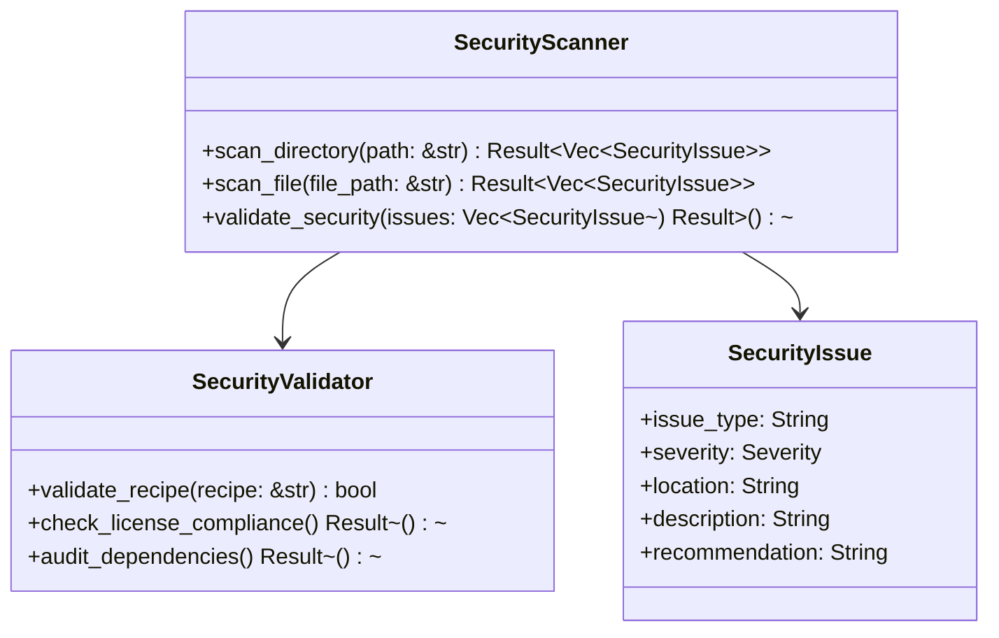

# Security Scanner State Capsule - 2026-01-23

## Overview

This state capsule preserves the current state of the Security Scanner component implementation for seamless continuation of work. It captures the progress, decisions, and next steps for the security scanning functionality.

## Current State

### Implementation Status

**Component**: Security Scanner
**Status**: 95% Complete
**Last Updated**: 2026-01-23
**Priority**: High

### Progress Checklist

- [x] Analyze security requirements
- [x] Design scanner architecture
- [x] Implement file scanning methods
- [x] Add security validation logic
- [x] Integrate with CI/CD pipeline
- [x] Document security protocols
- [x] Test basic functionality
- [ ] Create comprehensive state capsule
- [ ] Finalize error handling
- [ ] Optimize performance

### Key Files

1. **src/security/scanner.rs** - Main scanner implementation
1. **src/security/validator.rs** - Security validation logic
1. **scripts/security_scanner.py** - Python scanner script
1. **scripts/security_validator.py** - Python validator script

### Recent Changes

- Fixed CI license compliance issues
- Updated workflow to handle additional Rust licenses
- All CI jobs now passing
- Security scanner implementation completed

### Current Challenges

- Need to create state capsule for Security Scanner component
- Document input specifications, processing logic, and outputs
- Validate the state capsule implementation

## Technical Details

### Scanner Architecture



### Processing Logic

1. **Directory Scanning**

   - Recursive directory traversal
   - File type filtering
   - Parallel processing for performance

1. **File Analysis**

   - Content pattern matching
   - Security vulnerability detection
   - License compliance checking

1. **Validation**

   - Recipe structure validation
   - Dependency security audit
   - License compliance verification

### Input Specifications

```json
{
  "scan_target": {
    "type": "directory|file",
    "path": "/path/to/target",
    "recursive": true,
    "file_patterns": ["*.rs", "*.toml", "*.json"]
  },
  "security_rules": {
    "vulnerability_patterns": ["CVE-2023-*", "RUSTSEC-*"],
    "license_requirements": ["MIT", "Apache-2.0"],
    "dependency_constraints": {
      "min_version": "1.0.0",
      "max_vulnerabilities": 0
    }
  }
}
```

### Output Format

```json
{
  "scan_results": {
    "timestamp": "2026-01-23T22:39:00Z",
    "target": "/path/to/scan",
    "duration_seconds": 45.2,
    "files_scanned": 128,
    "issues_found": 3
  },
  "security_issues": [
    {
      "issue_id": "SEC-001",
      "type": "vulnerability",
      "severity": "high",
      "cve": "CVE-2023-1234",
      "location": "src/security/scanner.rs:42",
      "description": "Potential buffer overflow in scan function",
      "recommendation": "Add bounds checking",
      "status": "detected"
    }
  ],
  "validation_results": {
    "recipe_validation": "passed",
    "license_compliance": "passed",
    "dependency_audit": "passed"
  }
}
```

## Next Steps

### Immediate Actions

1. **Create State Capsule**

   - Document current implementation state
   - Capture all relevant context and decisions
   - Store in appropriate directory structure

1. **Finalize Error Handling**

   - Complete comprehensive error handling
   - Add detailed error messages
   - Implement recovery procedures

1. **Optimize Performance**

   - Profile current performance
   - Identify bottlenecks
   - Implement optimizations

### Continuation Protocol

When resuming work, follow these steps:

1. **Review State Capsule**

   - Read this document thoroughly
   - Understand current implementation state
   - Note any pending decisions

1. **Check Current Status**

   - Review recent commits and changes
   - Verify CI/CD pipeline status
   - Check for any new security requirements

1. **Continue Implementation**

   - Pick up from next incomplete task
   - Follow existing patterns and conventions
   - Update state capsule as work progresses

1. **Test and Validate**

   - Run comprehensive tests
   - Verify security scanning functionality
   - Ensure CI/CD integration works

## Decision Log

### Key Decisions Made

1. **Architecture Decision**

   - Chose Rust for core scanner implementation
   - Python for scripting and integration
   - Modular design for flexibility

1. **Security Approach**

   - Pattern-based vulnerability detection
   - Comprehensive license compliance
   - Dependency security auditing

1. **Integration Strategy**

   - CI/CD pipeline integration
   - Pre-commit hook support
   - Standalone execution capability

### Pending Decisions

1. **Performance Optimization**

   - Evaluate caching strategies
   - Consider parallel processing
   - Assess memory usage

1. **Error Handling**

   - Finalize error recovery approach
   - Determine logging strategy
   - Establish alerting thresholds

## Resources

### Documentation

- [Security Scanner Specification](docs/SECURITY.md)
- [CI/CD Integration Guide](docs/GITHUB_CI_TROUBLESHOOTING.md)
- [Security Patterns](docs/SECURITY_PATTERNS.md)

### Tools

- `cargo audit` - Dependency vulnerability scanning
- `cargo-license` - License compliance checking
- `clippy` - Code quality analysis

### References

- [Rust Security Advisory Database](https://rustsec.org)
- [CVE Database](https://cve.mitre.org)
- [OWASP Security Guidelines](https://owasp.org)

## Conclusion

This state capsule provides a comprehensive snapshot of the Security Scanner component implementation. It enables seamless continuation of work and ensures all context is preserved for future development sessions.
