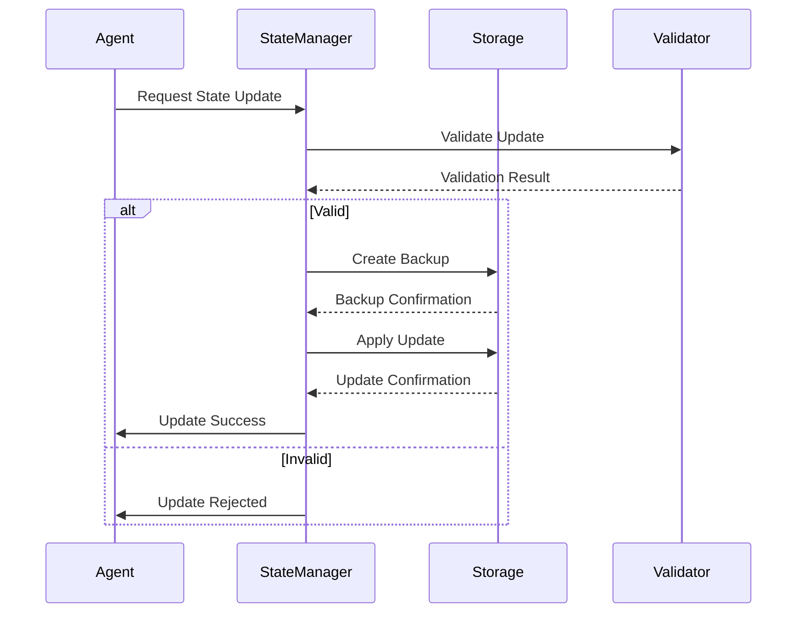
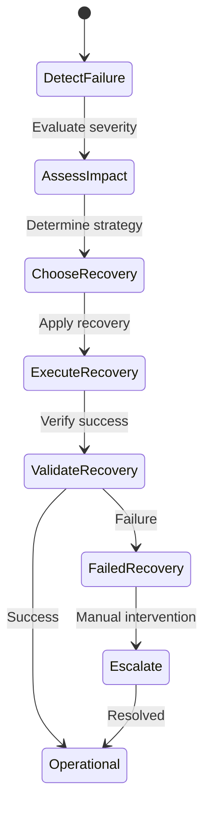
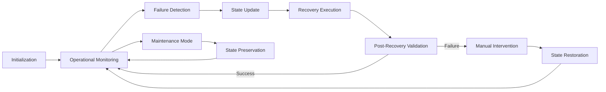

# CI/CD Monitoring State Capsule

## Overview

This document defines the state capsule structure for the CI/CD Monitoring and Automated Error Fixing System. The state capsule preserves critical monitoring state, failure history, and recovery information to enable seamless system operation across sessions and failures.

## State Capsule Structure

### 1. Core State Structure

```json
{
  "metadata": {
    "version": "1.0",
    "created_at": "2026-01-23T21:55:00Z",
    "updated_at": "2026-01-23T21:55:00Z",
    "capsule_id": "ci-monitoring-001"
  },
  "monitoring_state": {
    "system_status": "operational",
    "last_healthy_check": "2026-01-23T21:50:00Z",
    "current_alert_level": "normal",
    "monitoring_mode": "continuous"
  },
  "coverage_state": {
    "current_metrics": {
      "line": 98.5,
      "branch": 95.2,
      "function": 99.1,
      "integration": 88.7,
      "total": 96.4
    },
    "target_metrics": {
      "line": 100.0,
      "branch": 100.0,
      "function": 100.0,
      "integration": 100.0,
      "total": 100.0
    },
    "improvement_trend": "+13.2%",
    "last_analysis": "2026-01-23T21:45:00Z"
  },
  "failure_history": [],
  "auto_fix_history": [],
  "recovery_state": {
    "last_recovery": null,
    "recovery_count": 0,
    "mttr": null
  }
}
```

### 2. Monitoring State Details

```json
{
  "monitoring_state": {
    "system_status": "operational|degraded|failed|maintenance",
    "last_healthy_check": "ISO-8601 timestamp",
    "current_alert_level": "normal|elevated|high|critical",
    "monitoring_mode": "continuous|on-demand|disabled",
    "polling_interval": 60,
    "last_poll_time": "2026-01-23T21:54:00Z",
    "consecutive_failures": 0,
    "github_api_status": "operational",
    "last_workflow_run_id": 12345678,
    "active_alerts": 0,
    "suppressed_alerts": []
  }
}
```

### 3. Coverage State Details

```json
{
  "coverage_state": {
    "current_metrics": {
      "line": 98.5,
      "branch": 95.2,
      "function": 99.1,
      "integration": 88.7,
      "total": 96.4
    },
    "target_metrics": {
      "line": 100.0,
      "branch": 100.0,
      "function": 100.0,
      "integration": 100.0,
      "total": 100.0
    },
    "improvement_trend": "+13.2%",
    "coverage_gaps": [
      {
        "file": "src/security/scanner.rs",
        "line_coverage": 85.7,
        "branch_coverage": 78.3,
        "complexity": 12.4,
        "uncovered_lines": [42, 45, 48, 102-105],
        "uncovered_branches": ["error_handling", "edge_case"]
      }
    ],
    "last_analysis": "2026-01-23T21:45:00Z",
    "analysis_frequency": "daily",
    "coverage_trend": [
      {"date": "2026-01-20", "total": 83.2},
      {"date": "2026-01-21", "total": 88.7},
      {"date": "2026-01-22", "total": 92.1},
      {"date": "2026-01-23", "total": 96.4}
    ],
    "test_generation_queue": []
  }
}
```

### 4. Failure History Structure

```json
{
  "failure_history": [
    {
      "failure_id": "fail-001",
      "workflow_run_id": 12345678,
      "job_id": 87654321,
      "job_name": "HEE Security Scan",
      "failure_type": "security_vulnerability",
      "severity": "critical",
      "detected_at": "2026-01-23T21:30:00Z",
      "resolved_at": "2026-01-23T21:35:00Z",
      "resolution_method": "auto-fix",
      "resolution_details": "Updated vulnerable dependency",
      "pattern_id": "PAT-004",
      "impact": {
        "affected_components": ["security_scanner"],
        "downtime": "5 minutes",
        "recovery_time": "2 minutes"
      },
      "root_cause": "Outdated dependency with known CVE",
      "preventive_actions": ["Added dependency update check"],
      "status": "resolved"
    }
  ]
}
```

### 5. Auto-Fix History Structure

```json
{
  "auto_fix_history": [
    {
      "fix_id": "fix-001",
      "failure_id": "fail-001",
      "pattern_id": "PAT-004",
      "applied_at": "2026-01-23T21:32:00Z",
      "completed_at": "2026-01-23T21:35:00Z",
      "status": "success",
      "safety_level": "high",
      "rollback_performed": false,
      "changes_made": [
        {
          "file": "Cargo.toml",
          "change_type": "dependency_update",
          "old_version": "1.2.3",
          "new_version": "1.2.4",
          "cve_fixed": "CVE-2023-1234"
        }
      ],
      "validation_results": {
        "pre_fix": {
          "status": "passed",
          "timestamp": "2026-01-23T21:31:00Z"
        },
        "post_fix": {
          "status": "passed",
          "timestamp": "2026-01-23T21:34:00Z"
        }
      },
      "performance": {
        "execution_time": "180 seconds",
        "validation_time": "60 seconds",
        "total_time": "240 seconds"
      }
    }
  ]
}
```

### 6. Recovery State Structure

```json
{
  "recovery_state": {
    "last_recovery": {
      "recovery_id": "recover-001",
      "triggered_at": "2026-01-23T21:35:00Z",
      "completed_at": "2026-01-23T21:37:00Z",
      "trigger": "auto-fix_success",
      "recovery_type": "automatic",
      "system_status_before": "degraded",
      "system_status_after": "operational",
      "actions_taken": [
        "Updated state capsule",
        "Cleared active alerts",
        "Reset failure counters"
      ],
      "validation": {
        "ci_status": "passing",
        "coverage_verified": true,
        "system_health": "normal"
      }
    },
    "recovery_count": 1,
    "mttr": "120 seconds",
    "recovery_trend": [
      {"date": "2026-01-20", "mttr": 180},
      {"date": "2026-01-21", "mttr": 150},
      {"date": "2026-01-22", "mttr": 135},
      {"date": "2026-01-23", "mttr": 120}
    ],
    "recovery_capabilities": {
      "automatic_recovery": true,
      "manual_recovery": true,
      "rollback_capability": true,
      "state_restoration": true
    }
  }
}
```

## State Management Protocols

### 1. State Update Protocol



### 2. State Recovery Protocol



### 3. State Transition Rules

| Current State | Trigger               | Next State  | Conditions              |
| ------------- | --------------------- | ----------- | ----------------------- |
| Operational   | Failure detected      | Degraded    | Failure severity > low  |
| Operational   | Maintenance scheduled | Maintenance | Manual trigger          |
| Degraded      | Critical failure      | Failed      | Severity = critical     |
| Degraded      | Issues resolved       | Operational | All alerts cleared      |
| Failed        | Partial recovery      | Degraded    | Some functions restored |
| Failed        | Full recovery         | Operational | All functions restored  |
| Maintenance   | Update complete       | Operational | Validation passed       |

## State Capsule Operations

### 1. State Initialization

```python
def initialize_state_capsule():
    """
    Initialize a new state capsule with default values
    """
    capsule = {
        "metadata": {
            "version": "1.0",
            "created_at": datetime.utcnow().isoformat() + "Z",
            "updated_at": datetime.utcnow().isoformat() + "Z",
            "capsule_id": f"ci-monitoring-{uuid.uuid4().hex[:8]}"
        },
        "monitoring_state": {
            "system_status": "operational",
            "last_healthy_check": datetime.utcnow().isoformat() + "Z",
            "current_alert_level": "normal",
            "monitoring_mode": "continuous",
            "polling_interval": 60,
            "last_poll_time": None,
            "consecutive_failures": 0,
            "github_api_status": "operational",
            "last_workflow_run_id": None,
            "active_alerts": 0,
            "suppressed_alerts": []
        },
        "coverage_state": {
            "current_metrics": {
                "line": 0.0,
                "branch": 0.0,
                "function": 0.0,
                "integration": 0.0,
                "total": 0.0
            },
            "target_metrics": {
                "line": 100.0,
                "branch": 100.0,
                "function": 100.0,
                "integration": 100.0,
                "total": 100.0
            },
            "improvement_trend": "0%",
            "coverage_gaps": [],
            "last_analysis": None,
            "analysis_frequency": "daily",
            "coverage_trend": [],
            "test_generation_queue": []
        },
        "failure_history": [],
        "auto_fix_history": [],
        "recovery_state": {
            "last_recovery": None,
            "recovery_count": 0,
            "mttr": None,
            "recovery_trend": [],
            "recovery_capabilities": {
                "automatic_recovery": True,
                "manual_recovery": True,
                "rollback_capability": True,
                "state_restoration": True
            }
        }
    }
    return capsule
```

### 2. State Update Operations

```python
def update_monitoring_state(capsule, updates):
    """
    Update monitoring state with validation
    """
    # Validate update
    if not validate_monitoring_update(updates):
        raise ValueError("Invalid monitoring state update")

    # Apply update
    capsule["monitoring_state"].update(updates)
    capsule["monitoring_state"]["updated_at"] = datetime.utcnow().isoformat() + "Z"

    # Update metadata
    capsule["metadata"]["updated_at"] = datetime.utcnow().isoformat() + "Z"

    return capsule
```

### 3. State Recovery Operations

```python
def recover_from_failure(capsule, failure_id):
    """
    Execute recovery procedure for a specific failure
    """
    # Find failure in history
    failure = next((f for f in capsule["failure_history"] if f["failure_id"] == failure_id), None)
    if not failure:
        raise ValueError(f"Failure {failure_id} not found")

    # Execute recovery based on failure type
    if failure["severity"] in ["critical", "high"]:
        return execute_critical_recovery(capsule, failure)
    else:
        return execute_standard_recovery(capsule, failure)
```

## State Validation and Integrity

### 1. Validation Rules

```json
{
  "validation_rules": {
    "system_status": {
      "type": "string",
      "enum": ["operational", "degraded", "failed", "maintenance"],
      "required": true
    },
    "current_alert_level": {
      "type": "string",
      "enum": ["normal", "elevated", "high", "critical"],
      "required": true
    },
    "coverage_metrics": {
      "type": "object",
      "properties": {
        "line": {"type": "number", "minimum": 0, "maximum": 100},
        "branch": {"type": "number", "minimum": 0, "maximum": 100},
        "function": {"type": "number", "minimum": 0, "maximum": 100},
        "integration": {"type": "number", "minimum": 0, "maximum": 100},
        "total": {"type": "number", "minimum": 0, "maximum": 100}
      },
      "required": true
    },
    "failure_history": {
      "type": "array",
      "items": {
        "type": "object",
        "properties": {
          "failure_id": {"type": "string", "pattern": "^fail-\\d{3}$"},
          "severity": {"type": "string", "enum": ["low", "medium", "high", "critical"]}
        },
        "required": ["failure_id", "severity"]
      }
    }
  }
}
```

### 2. Integrity Checks

```python
def validate_state_integrity(capsule):
    """
    Validate state capsule integrity
    """
    checks = {
        "metadata_present": "metadata" in capsule,
        "valid_timestamps": validate_timestamps(capsule),
        "status_valid": capsule["monitoring_state"]["system_status"] in ["operational", "degraded", "failed", "maintenance"],
        "coverage_valid": validate_coverage_metrics(capsule["coverage_state"]["current_metrics"]),
        "history_consistent": validate_history_consistency(capsule),
        "recovery_valid": validate_recovery_state(capsule["recovery_state"])
    }

    # Check for any failed validations
    failed_checks = [check for check, result in checks.items() if not result]

    return {
        "valid": len(failed_checks) == 0,
        "checks": checks,
        "failed_checks": failed_checks
    }
```

### 3. Backup and Restore

```python
def create_state_backup(capsule):
    """
    Create a backup of the current state
    """
    backup = {
        "backup_id": f"backup-{uuid.uuid4().hex[:8]}",
        "created_at": datetime.utcnow().isoformat() + "Z",
        "source_capsule_id": capsule["metadata"]["capsule_id"],
        "state": deepcopy(capsule)
    }

    # Store backup
    backup_path = f"backups/{backup['backup_id']}.json"
    with open(backup_path, 'w') as f:
        json.dump(backup, f, indent=2)

    return backup
```

## State Capsule Lifecycle

### 1. Lifecycle Diagram



### 2. Lifecycle Management

| Phase            | Responsibilities            | Duration     | Frequency |
| ---------------- | --------------------------- | ------------ | --------- |
| Initialization   | Create initial state        | < 1 second   | Once      |
| Operational      | Continuous monitoring       | Indefinite   | Always    |
| Failure Handling | Detect and record failures  | < 2 minutes  | As needed |
| Recovery         | Execute recovery procedures | < 5 minutes  | As needed |
| Maintenance      | System updates and backups  | 5-30 minutes | Weekly    |
| Validation       | State integrity checks      | < 1 minute   | Hourly    |

## Integration with Monitoring System

### 1. State Monitoring Integration

```python
def integrate_with_monitoring(capsule):
    """
    Integrate state capsule with monitoring system
    """
    # Update monitoring system with current state
    monitoring_system.update_state({
        "system_status": capsule["monitoring_state"]["system_status"],
        "alert_level": capsule["monitoring_state"]["current_alert_level"],
        "coverage_metrics": capsule["coverage_state"]["current_metrics"]
    })

    # Configure monitoring based on state
    if capsule["monitoring_state"]["system_status"] == "degraded":
        monitoring_system.set_polling_interval(30)
    else:
        monitoring_system.set_polling_interval(60)

    # Return integration status
    return {
        "status": "integrated",
        "monitoring_mode": monitoring_system.get_mode(),
        "polling_interval": monitoring_system.get_polling_interval()
    }
```

### 2. Auto-Fix Integration

```python
def integrate_with_auto_fix(capsule):
    """
    Integrate state capsule with auto-fix system
    """
    # Provide auto-fix system with current state
    auto_fix_system.update_context({
        "current_failures": [f for f in capsule["failure_history"] if f["status"] == "detected"],
        "recent_fixes": capsule["auto_fix_history"][-5:],  # Last 5 fixes
        "system_status": capsule["monitoring_state"]["system_status"]
    })

    # Configure auto-fix based on state
    if capsule["monitoring_state"]["system_status"] == "failed":
        auto_fix_system.set_mode("conservative")
    else:
        auto_fix_system.set_mode("normal")

    # Return integration status
    return {
        "status": "integrated",
        "auto_fix_mode": auto_fix_system.get_mode(),
        "pending_fixes": len(auto_fix_system.get_pending_fixes())
    }
```

## State Capsule Storage and Retrieval

### 1. Storage Protocol

```json
{
  "storage_protocol": {
    "format": "JSON",
    "encoding": "UTF-8",
    "compression": "none",
    "location": "docs/STATE_CAPSULES/ci_monitoring_state.json",
    "backup_location": "backups/ci_monitoring/",
    "retention_policy": {
      "primary": "indefinite",
      "backups": "30 days",
      "archive": "1 year"
    },
    "access_control": {
      "read": ["monitoring_system", "auto_fix_system", "admin"],
      "write": ["state_manager", "admin"],
      "delete": ["admin"]
    }
  }
}
```

### 2. Retrieval Protocol

```python
def retrieve_state_capsule():
    """
    Retrieve the current state capsule
    """
    try:
        # Primary location
        with open("docs/STATE_CAPSULES/ci_monitoring_state.json", 'r') as f:
            capsule = json.load(f)

        # Validate integrity
        validation = validate_state_integrity(capsule)
        if not validation["valid"]:
            raise ValueError(f"State integrity check failed: {validation['failed_checks']}")

        return capsule

    except FileNotFoundError:
        # Initialize new capsule if not found
        return initialize_state_capsule()
    except Exception as e:
        # Fallback to backup if primary corrupted
        return restore_from_backup()
```

## State Capsule Evolution

### 1. Version Migration

```python
def migrate_state_capsule(capsule, target_version):
    """
    Migrate state capsule to new version
    """
    current_version = capsule["metadata"]["version"]

    if current_version == target_version:
        return capsule

    # Define migration paths
    migrations = {
        "1.0": {
            "1.1": migrate_to_1_1,
            "1.2": migrate_to_1_2
        },
        "1.1": {
            "1.2": migrate_to_1_2
        }
    }

    # Execute migration path
    while current_version != target_version:
        next_version = get_next_version(current_version, target_version)
        migration_func = migrations[current_version][next_version]
        capsule = migration_func(capsule)
        current_version = next_version

    # Update version
    capsule["metadata"]["version"] = target_version
    capsule["metadata"]["updated_at"] = datetime.utcnow().isoformat() + "Z"

    return capsule
```

### 2. Schema Evolution

```json
{
  "schema_evolution": {
    "1.0": {
      "description": "Initial release",
      "changes": "Initial state capsule structure"
    },
    "1.1": {
      "description": "Enhanced coverage tracking",
      "changes": [
        "Added integration coverage metric",
        "Enhanced coverage gap analysis",
        "Added test generation queue"
      ],
      "migration": {
        "add_integration_coverage": true,
        "initialize_test_queue": true
      }
    },
    "1.2": {
      "description": "Improved recovery tracking",
      "changes": [
        "Enhanced recovery state structure",
        "Added MTTR tracking",
        "Improved failure impact analysis"
      ],
      "migration": {
        "add_mttr_tracking": true,
        "enhance_recovery_history": true
      }
    }
  }
}
```

## Conclusion

This state capsule specification provides a comprehensive framework for preserving and managing the CI/CD Monitoring System's state. The structured approach ensures data integrity, enables seamless recovery, and supports the system's evolution over time. The state capsule serves as the single source of truth for monitoring status, failure history, and recovery operations, enabling reliable operation across sessions and failures.
