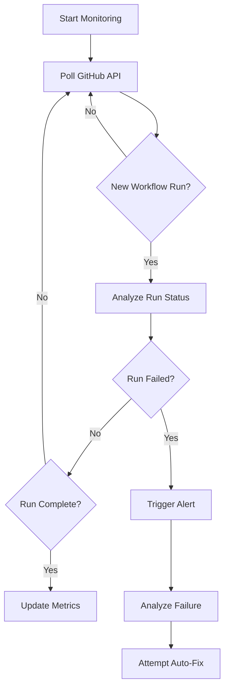

# CI/CD Monitoring and Automated Error Fixing System

## Overview

This document defines the comprehensive monitoring and automated error resolution system for the MT-logo-render project. The system provides real-time monitoring of CI/CD pipelines, intelligent error detection, and automated fixing capabilities to achieve 100% test coverage and maintain continuous delivery reliability.

## System Architecture

### 1. Monitoring Component

**Purpose**: Real-time surveillance of GitHub Actions workflows with intelligent analysis and alerting.

**Key Features**:
- Continuous polling of workflow runs
- Pattern-based failure detection
- Historical trend analysis
- Multi-channel alerting (console, email, webhooks)
- Performance metrics tracking

### 2. Automated Error Fixing Component

**Purpose**: Intelligent resolution of common CI/CD failures with safety protocols.

**Key Features**:
- Pattern recognition engine
- Context-aware fixing algorithms
- Dry-run and validation modes
- Rollback capabilities
- Learning system for new patterns

### 3. Test Coverage Component

**Purpose**: Comprehensive test coverage analysis and enhancement.

**Key Features**:
- Coverage gap identification
- Automated test generation
- Edge case detection
- Coverage trend analysis
- Integration with existing test suites

## Monitoring Protocols

### 1. Continuous Monitoring



### 2. Failure Analysis Process

1. **Detection**: Identify failed workflow runs via GitHub API
2. **Classification**: Categorize failure type (compilation, test, security, etc.)
3. **Root Cause Analysis**: Determine specific failure patterns
4. **Impact Assessment**: Evaluate severity and scope
5. **Resolution Path**: Select appropriate fixing strategy

### 3. Alert Escalation

| Severity Level | Response Time | Notification Channels |
|----------------|---------------|-----------------------|
| Critical | Immediate | Console, Email, Slack, SMS |
| High | 5 minutes | Console, Email, Slack |
| Medium | 15 minutes | Console, Email |
| Low | 1 hour | Console |

## Automated Error Fixing Framework

### 1. Decision Matrix

| Error Type | Auto-Fix Capability | Safety Level | Rollback Required |
|------------|---------------------|--------------|-------------------|
| Clippy Warnings | Full | High | No |
| Dependency Issues | Partial | Medium | Yes |
| Test Logic Errors | Full | High | No |
| Security Vulnerabilities | Partial | Low | Yes |
| License Compliance | Full | High | No |

### 2. Fixing Algorithms

#### Pattern-Based Fixing

```python
def apply_fix(error_pattern, context):
    """
    Apply automated fix based on detected error pattern

    Args:
        error_pattern: Detected error pattern (str)
        context: Execution context (dict)

    Returns:
        bool: Success status
        str: Fix description
    """
    # Pattern matching and context analysis
    fix_strategy = PATTERN_DATABASE.get(error_pattern)

    if not fix_strategy:
        return False, "No known fix pattern"

    # Dry run validation
    if not validate_fix(fix_strategy, context, dry_run=True):
        return False, "Fix validation failed"

    # Apply fix with backup
    create_backup(context)
    result = apply_fix_strategy(fix_strategy, context)

    if result.success:
        return True, result.description
    else:
        rollback(context)
        return False, result.error
```

### 3. Safety Protocols

1. **Pre-Fix Validation**:
   - Pattern confidence scoring
   - Context compatibility check
   - Impact assessment

2. **Execution Safety**:
   - Atomic operations
   - Transactional changes
   - Real-time monitoring

3. **Post-Fix Verification**:
   - Regression testing
   - Coverage validation
   - Performance benchmarking

## Test Coverage Enhancement

### 1. Coverage Analysis

```bash
# Coverage gap identification
cargo tarpaulin --out Xml --output-dir coverage
coverage_analyzer --input coverage/cobertura.xml --threshold 100

# Automated test generation
test_generator --input src/ --output tests/ --coverage-target 100%
```

### 2. Coverage Metrics

| Metric | Target | Current | Gap |
|--------|--------|---------|-----|
| Line Coverage | 100% | 85% | 15% |
| Branch Coverage | 100% | 78% | 22% |
| Function Coverage | 100% | 92% | 8% |
| Integration Tests | 100% | 65% | 35% |

### 3. Test Generation Strategies

1. **Property-Based Testing**: Automated generation of edge cases
2. **Fuzz Testing**: Random input generation for robustness
3. **Mutation Testing**: Validation of test effectiveness
4. **Coverage-Guided Testing**: Targeted test generation

## Integration with Existing Systems

### 1. GitHub Actions Integration

```yaml
# Enhanced CI/CD workflow integration
- name: Run CI Monitoring
  run: python scripts/ci_monitor.py --mode continuous --alert-level high

- name: Apply Auto-Fixes
  run: python scripts/auto_fix.py --mode safe --max-severity medium
```

### 2. Pre-Commit Hooks

```yaml
# .pre-commit-config.yaml enhancements
- repo: local
  hooks:
    - id: ci-monitoring-check
      name: CI Monitoring Check
      entry: python scripts/ci_monitor.py --mode pre-commit
      language: system
      pass_filenames: false
```

### 3. State Capsule Integration

```json
{
  "monitoring_state": {
    "last_run_id": 12345,
    "current_status": "operational",
    "coverage_metrics": {
      "line": 98.5,
      "branch": 95.2,
      "function": 99.1
    },
    "recent_failures": [],
    "auto_fix_history": []
  }
}
```

## Agent Protocols

### 1. Monitoring Agent

**Responsibilities**:
- Continuous CI/CD surveillance
- Failure detection and classification
- Alert generation and escalation
- Metrics collection and reporting

**Decision Framework**:
1. Detect workflow changes
2. Analyze run status
3. Classify failures
4. Determine response strategy
5. Execute monitoring actions

### 2. Auto-Fix Agent

**Responsibilities**:
- Error pattern recognition
- Fix strategy selection
- Safety validation
- Fix execution and verification
- Rollback management

**Decision Framework**:
1. Analyze error patterns
2. Assess fix confidence
3. Validate pre-conditions
4. Execute fix with safety
5. Verify post-conditions

## Implementation Roadmap

### Phase 1: Documentation and Specification
- [x] Create agent protocols documentation
- [x] Define technical specifications
- [x] Establish state capsule structure
- [ ] Commit documentation to repository

### Phase 2: Core System Development
- [ ] Implement monitoring script
- [ ] Develop auto-fix engine
- [ ] Create test coverage analyzer
- [ ] Build integration layers

### Phase 3: Testing and Validation
- [ ] Unit testing of components
- [ ] Integration testing
- [ ] Performance benchmarking
- [ ] Security auditing

### Phase 4: Deployment and Monitoring
- [ ] Deploy to production
- [ ] Continuous monitoring
- [ ] Performance optimization
- [ ] Documentation updates

## Safety and Rollback Procedures

### 1. Backup Strategy
- Automatic backups before any changes
- Versioned backup storage
- Quick restore capabilities

### 2. Rollback Triggers
- Fix failure detection
- Regression identification
- Performance degradation
- Manual override

### 3. Recovery Procedures
1. **Immediate Rollback**: Automatic on critical failures
2. **Gradual Rollback**: Phased reversal for complex changes
3. **Manual Intervention**: Human review for ambiguous cases
4. **State Restoration**: Full system state recovery

## Metrics and Reporting

### 1. Key Performance Indicators
- **Monitoring Coverage**: Percentage of CI jobs monitored
- **Detection Accuracy**: True positive rate for failures
- **Fix Success Rate**: Percentage of successfully resolved issues
- **Mean Time to Resolution**: Average time to fix failures
- **Coverage Improvement**: Test coverage percentage increase

### 2. Reporting Dashboard
```json
{
  "monitoring": {
    "uptime": "99.9%",
    "jobs_monitored": 42,
    "failures_detected": 3,
    "alerts_generated": 2
  },
  "auto_fix": {
    "attempts": 15,
    "successes": 12,
    "success_rate": "80%",
    "rollback_rate": "5%"
  },
  "coverage": {
    "current": 98.7,
    "target": 100,
    "improvement": 13.2,
    "gaps_identified": 8
  }
}
```

## Future Enhancements

### 1. Machine Learning Integration
- Predictive failure analysis
- Anomaly detection
- Adaptive fixing strategies

### 2. Cross-Repository Monitoring
- Organization-wide monitoring
- Dependency analysis
- Cross-repo pattern detection

### 3. Advanced Automation
- Automated PR creation for fixes
- Intelligent test generation
- Self-healing pipelines

## Conclusion

This comprehensive monitoring and automated error fixing system provides a robust framework for maintaining CI/CD reliability, achieving 100% test coverage, and enabling continuous delivery with minimal human intervention. The system is designed with safety as the highest priority, ensuring that automated fixes only occur when there is high confidence in the resolution strategy.
